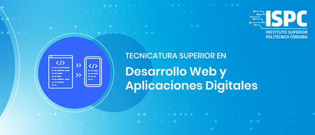

# Actividad Git - GitHub | ISPC TSDWAD

## ¿Que es Scrum?

Scrum es un framework Agile para el desarrollo y el mantenimiento de productos complejos en entornos adaptables. Dividiendolos en pequeñas versiones, entregables al cliente, para recibir feedback

La metodología Scrum se basa en la entrega de un producto, sin terminar, con características funcionales, al cual se le va añadiendo más en la siguiente iteración.

Para ello nace un concepto clave, el Sprint, que es un bloque de tiempo donde el equipo se compromete a entregar un producto iterable con características previamente acordadas 

## Valores de Scrum

### Sprint

# Roles
<!-- Rol Product Owner -->

<!-- Rol Scrum Master -->

<!-- Rol Scrum Team -->

# Ceremonia
<!-- Ceremonia Sprint Planning-->

<!-- Ceremonia Daily Scrum-->

<!-- Ceremonia Daily Scrum-->

<!-- Ceremonia Sprint Review-->

<!-- Ceremonia Sprint Retrospective-->

# Artefactos
<!-- Artefacto Product Backlog -->

<!-- Artefacto Sprint Backlog -->

<!-- Artefacto Impediments Backlog -->

<!-- Artefacto Burndown Chart -->
